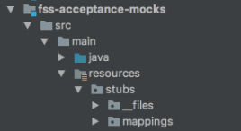

#WIREMOCK

---
##Agenda

* Introduction to wiremock
* How is it used in flight-service?

---
##Features

* Running Wiremock
* Request matching
* Record and Playback

---

##Running WireMock

1. in junit mode

2. as a standalone jar

mappings are available at http://localhost:9960/__admin/mappings 

+++

in junit mode

```java
@org.junit.Rule
public WireMockRule wireMockRule = new WireMockRule(WireMockConfiguration.options()
                                    .port(9521)
                                    .usingFilesUnderDirectory("../fss-acceptance-mocks/src/main/resources/stubs"));

```

+++

1. can be started directly using JAR
```java
java -jar wiremock-standalone-2.7.1.jar
```
2. can be started programmatically
```java
   public static void main(String[] args) {
       int wireMockPort = retrieveWireMockPort(args);
       int providerMocksPort = retrieveProviderMocksPort(args);
       String stubsDirectory = retrieveStubsDirectory(args);
       startWireMock(wireMockPort, providerMocksPort, stubsDirectory);
   }
    
   public static WireMockServer startWireMock(int wireMockPort, int providerMocksPort, String stubsDirectory) {
       LOGGER.info("Start mocked flight-service external service mock server on port {}", wireMockPort);
       WireMockServer wireMockServer = WireMockInitializer.initialize(wireMockPort, providerMocksPort, stubsDirectory);
       wireMockServer.start();
       LOGGER.info("Mocked flight-service external service mock server successfully started on port {}", wireMockPort);
       return wireMockServer;
   }
```

---

##Request Matching

+++



mapping : 
```json
{
  "priority": 1,
  "request": {
    "customMatcher": {
      "name": "fast-infoset-request-matcher",
      "parameters": {
        "url": "/provider-mocks/sabre/get-details",
        "method": "POST",
        "headers": {
          "Transaction-Id": {
            "equalTo": "SABRE RT pricing with a BUSINESS fare"
          }
        },
        "bodyPatterns": [
        ]
      }
    }
  },
  "response": {
    "status": 200,
    "bodyFileName": "pricing/sabre_pricing_cabin_class/body-sabre-getdetails.xml",
    "headers": {
      "Server": "Apache-Coyote/1.1",
      "User-Agent": "Apache CXF 3.0.4",
      "Content-Type": "text/xml;charset=UTF-8",
      "Accept": "*/*",
      "Accept-Encoding": "gzip;q=1.0, identity; q=0.5, *;q=0"
    }
  }
}
```

---

##Record and Playback

latest version of wiremock can record using web interface http://localhost:8080/__admin/recorder


---

##How Egencia flight-service uses wiremock

